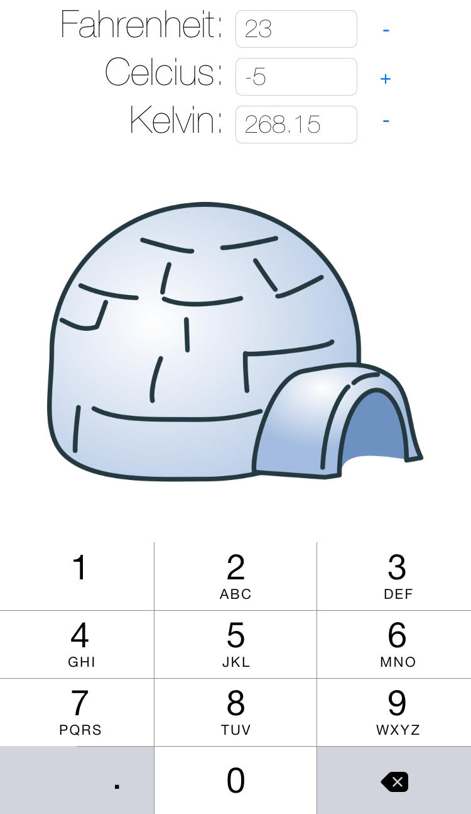

TempConverter
-------------

A simple and quick app I created to excite a class of 6th grade science
students about STEM careers.

I showed the "finished" app first, and then had the students help me populate
the functions in `TemperatureConversions.m`, using information the students
had recently learned in their science class. Other things that could be shown
are the *complexities* of writing software, like dealing floating point,
unexpected text input, etc. I chose to avoid these topics, but there are
areas in the code you could utilize to showcase these if students want a
challenge.

